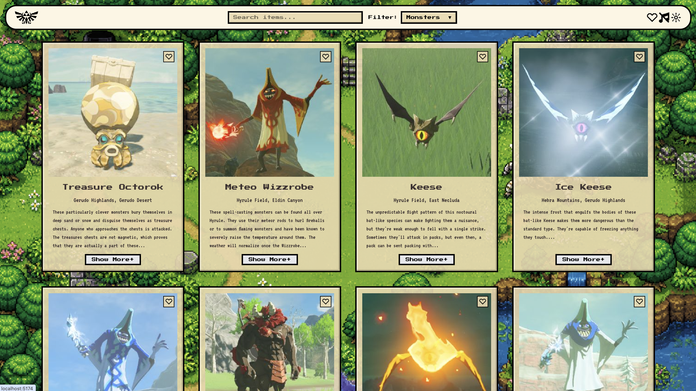

<div align="center">
  
  <h1>Hyrule Compendium</h1>
  <p>A full-stack web app inspired by The Legend of Zelda: Breath of the Wild.</p>
</div>

## About

Hyrule Compendium is a personal learning project for practising full-stack web
development, PostgreSQL, Docker, and cloud deployment. It lets users browse and
search compendium entries in a pixel-inspired interface.

## Preview



## Features

- Browse entries by category
- Search across the compendium
- Save favourite entries
- Switch between light and dark themes
- Responsive card layout with pagination

## Tech stack

- React, TypeScript, Vite and Tailwind CSS
- Node.js and Express
- PostgreSQL
- Docker and Docker Compose

## Project structure

```text
Hyrule-Compendium/
├── frontend/           # React frontend
├── backend/            # Express API and database seed
├── .env.example        # Environment-variable template
├── Dockerfile          # Production image
└── docker-compose.yml  # Local app and database setup
```

## Run locally with Docker

### Prerequisites

- Docker Desktop with Docker Compose

### Setup

1. Create a local environment file:

   ```bash
   cp .env.example .env
   ```

2. Replace the placeholder password in `.env`.

3. Start PostgreSQL:

   ```bash
   docker compose up -d db
   ```

4. Seed the database:

   ```bash
   docker compose run --rm seed
   ```

5. Build and start the app:

   ```bash
   docker compose up --build app
   ```

Open [http://localhost:3000](http://localhost:3000).

> [!WARNING]
> The seed command drops and recreates the compendium table.

## Data source

Compendium data in [`backend/data/hyrule.json`](backend/data/hyrule.json) is a
locally stored snapshot sourced from the
[Hyrule Compendium API](https://github.com/gadhagod/Hyrule-Compendium-API) by
Aarav Borthakur. Entry images are loaded from the upstream API at runtime. The
upstream project is available under the
[MIT License](https://github.com/gadhagod/Hyrule-Compendium-API/blob/master/LICENSE).

## Disclaimer

This is an educational, unofficial fan project. It is not affiliated with or
endorsed by Nintendo. The Legend of Zelda and related names, images, audio,
trademarks, and game content belong to their respective owners.
